# VR项目展示

## 项目演示

  

  

---

# 项目结构

## 1. 头部追踪模块

  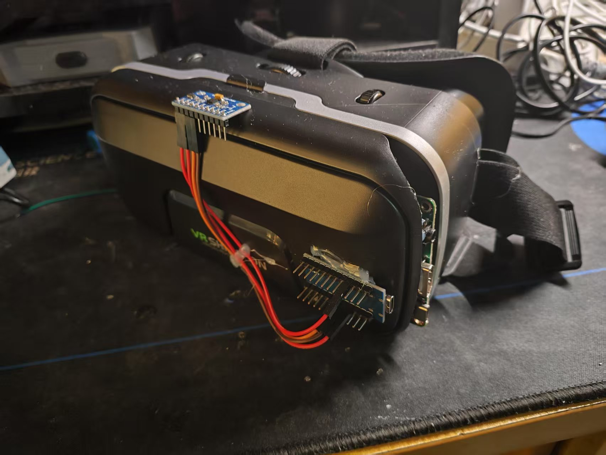
  
<strong>VR头显实物图</strong>

### 技术原理

以Arduino Micro开发板作为头部追踪核心，使用I2C接口与MPU9250传感器实现连接，实时采集三轴上的加速度、角速度和磁力计数据。板载USB-HID协议栈直接实现跟PC的通信连接，摆脱外部串口芯片，硬件设计实现精简。

系统采用优化后的Madgwick算法运行，按512Hz采样率对多源传感数据进行融合，以120Hz频率更新输出归一化四元数，采用定制的HID报告描述符传递到SteamVR驱动，达成存在毫秒级延迟的虚拟头部运动追踪。

### 硬件组件

#### 核心控制与传感器

<table>
  <tr>
    <td align="center" width="50%">
      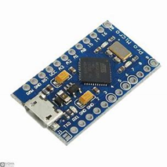
      
<strong>Arduino Micro</strong>

    </td>
    <td align="center" width="50%">
      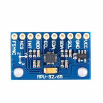
      
<strong>MPU9250传感器</strong>

    </td>
  </tr>
</table>

MPU9250 可谓一款 9 轴惯性测量单元，组合了三轴加速度计、三轴陀螺仪及三轴磁力计，能实时采集头部运动的动态姿态资料，所采用的加速度计量程为± 16g，该陀螺仪量程设定为± 2000 °/s，磁力计的量程设定为± 4800μT，经由I2C接口跟Arduino Micro实现通信，采样率最高可升至1000Hz。

该传感器要跟Madgwick滤波算法相结合，把加速度计的静态稳定性与陀螺仪的动态响应优势融合，降低陀螺仪的漂移误差，输出稳定的四元数姿态数值，MPU9250 固定到 VR 头显支架之上，依靠USB串口把数据实时传输到PC端，推动虚拟角色头部做出运动。

#### 显示组件

<table>
  <tr>
    <td align="center" width="50%">
      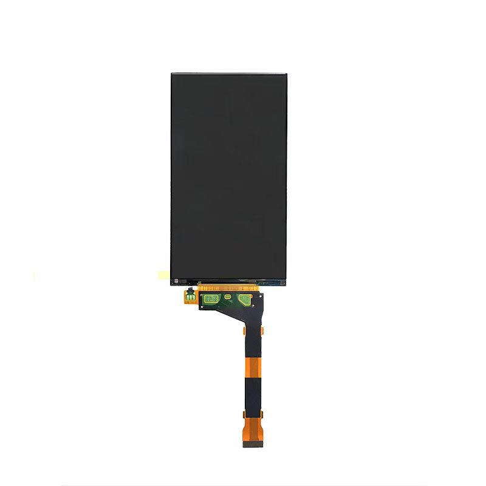
      
<strong>VR屏幕</strong>

    </td>
    <td align="center" width="50%">
      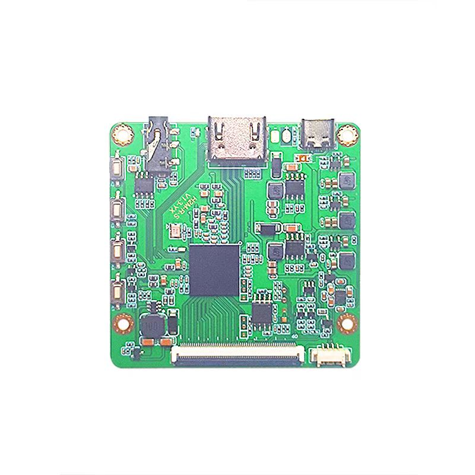
      
<strong>屏幕驱动板</strong>

    </td>
  </tr>
</table>

ls055r1sx04高清显示屏，分辨率为1920×1080，支持高刷新率与低延迟显示，适配SteamVR平台的沉浸式视觉需求。

HDMI驱动板充当头显的核心控制单元，接收PC端所渲染的虚拟场景信号，经由HDMI 2.0接口传至屏幕，保证图像传输的实时效果与稳定状态，驱动板实现了电源管理功能的集成，支持接收5V直流输入，采用USB - C接口和PC端进行同步供电，实现线缆布局的简化处理。

---

## 2. 手部追踪模块

  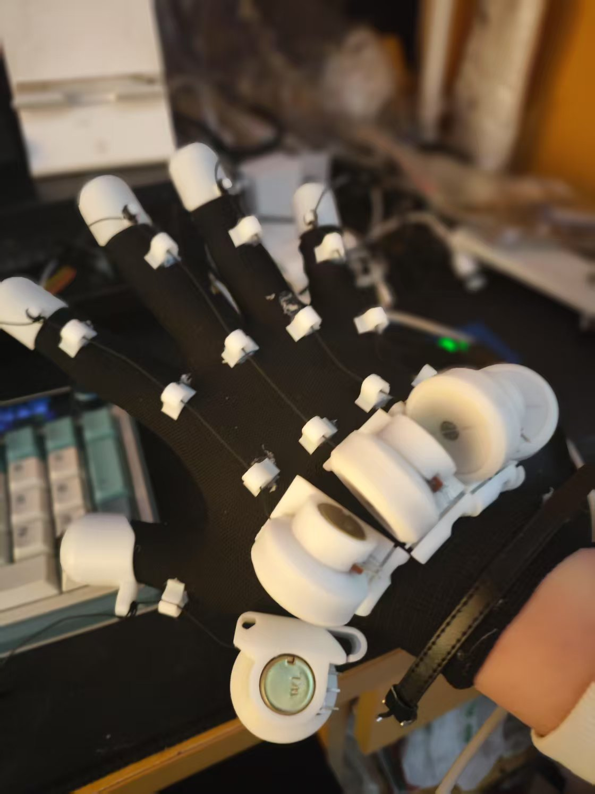
  
<strong>手部追踪手套实物图</strong>

### 技术原理

Arduino Nano开发板借助模拟输入引脚获取WH148电位器的弯曲信号，经USB串口以有线渠道传输到PC端，实现基本的手部动作捕捉效果。

为增进灵活性，系统升级采用ESP32开发板开展，凭借蓝牙低功耗（BLE）协议实现无线的数据传送，维持相同传感器接口的同时对穿戴舒适性进行优化。手部追踪模块可采用有线和无线双模式，用户可依照需求去选择连接方式，兼顾了低成本与高自由度的场景情形。

### 硬件组件
#### 核心控制
<!-- 使用HTML表格实现图片并列 -->
<table>
  <tr>
    <td align="center" width="50%">
      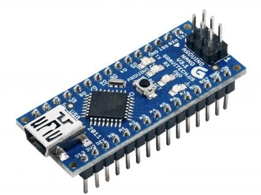
      
<strong>Arduino Nano</strong>

    </td>
    <td align="center" width="50%">
      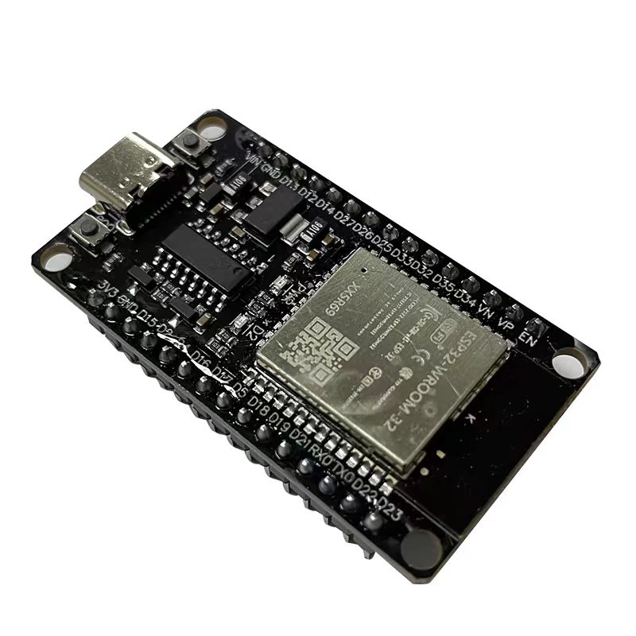
      
<strong>ESP32开发板</strong>

    </td>
  </tr>
</table>

  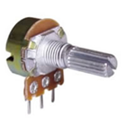
  
<strong>WH148电位器</strong>

WH148电位器充当低成本弯曲传感器，借助模拟电压0 - 5V的变化体现手指关节0 - 180°的弯曲角度，线性度误差采用分段标定的方式进行补偿，刚开始的版本里面，WH148与Arduino Nano的ADC引脚实现连接，按照10位分辨率采集弯曲信号，经过数字滤波后依靠USB串口进行传输。

升级版采用ESP32这块开发板，借助蓝牙低功耗（BLE）协议实现无线传送，把延迟控制在20ms以内，将传感器嵌入柔性手套的指关节部位，用户抓取虚拟对象时，把弯曲信号映射至虚拟手指骨骼，实现捏合、握拳这类精细动作的交互。

---

## 3. 肢体追踪模块

  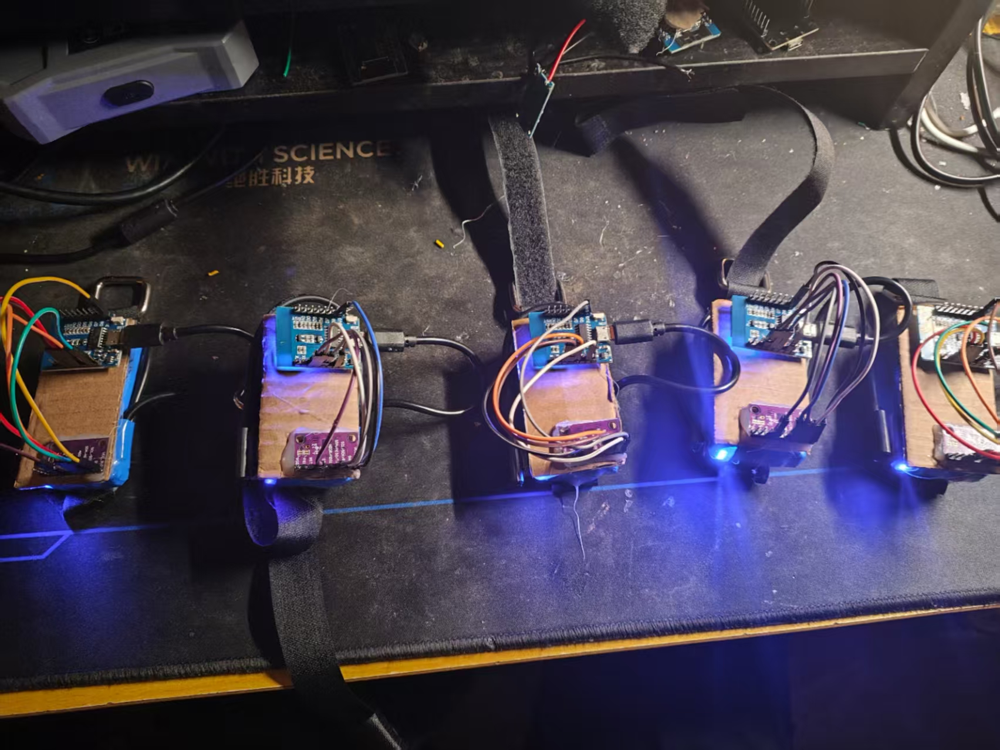
  
<strong>肢体追踪模块实物图</strong>

### 技术原理

NodeMCU（ESP8266）开发板借助I2C接口与BNO085传感器相连，读取其内置的传感器融合算法输出的已校准四元数数据，还借助Wi-Fi模块把数据无线传送到PC端。

每个NodeMCU节点独立承担左右大臂、小臂和手腕的动作捕捉相关工作，适配多节点同步通信需求，顺应上半身追踪需求。

### 硬件组件
#### 核心控制与传感器
<!-- 使用HTML表格实现图片并列 -->
<table>
  <tr>
    <td align="center" width="50%">
      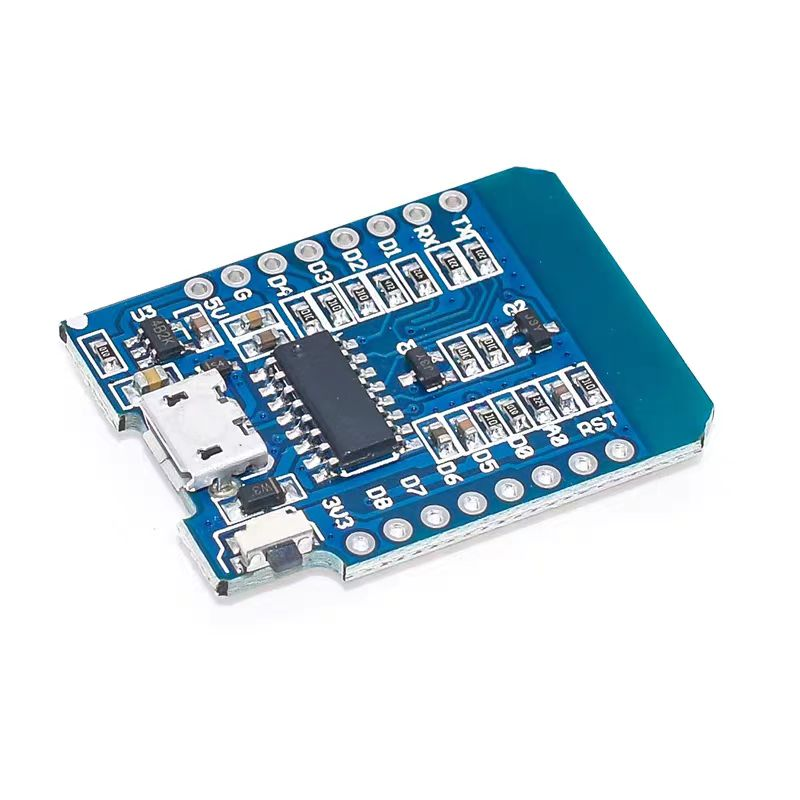
      
<strong>ESP8266开发板</strong>

    </td>
    <td align="center" width="50%">
      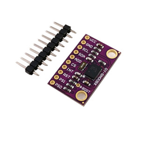
      
<strong>BNO085传感器</strong>

    </td>
  </tr>
</table>

BNO085为一款内置传感器融合算法的九轴IMU，以I2C接口为通道直接输出校准后的四元数姿态数据，省去主控端的复杂运算，其动态姿态解算的误差小于1°，可按照100Hz的数据输出频率工作，适应低功耗无线传输的要求，传感器跟NodeMCU（ESP8266）开发板加以连接，利用Wi-Fi模块借助UDP协议把数据同步到PC端，实现腰部、左右大臂及小臂的追踪需求。

BNO085因高精度特性而能够准确地捕捉肢体旋转与位移，好比手臂摆动跟腰部转动动作，为虚拟角色给予连贯的骨骼驱动信号。

## 4. 3d打印设计部分

在设计的VR眼镜外壳及手套3D打印模型里，外壳采用了贴合人体工学的设计，保证佩戴起来舒适，操作也轻松，手套部分围绕关节设计做了优化处理，采用了白色树脂材质，谋求在保证灵活性的时候提供充足支撑，各个设计都顾及到人体工学原理，保证佩戴者在使用时能体会到自然的贴合与舒适感，符合长期佩戴的需求，这些设计不只看重实用性，还同时顾及了美观与耐用性，充分契合了VR体验的需求。

### 手指关节手套

  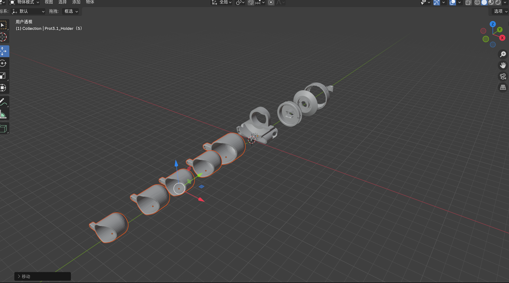
  
<strong>手指关节建模</strong>

手套部分针对关节设计进行了优化，使用了白色树脂材料，力求在保证灵活性的同时提供足够的支撑，确保佩戴者在使用过程中感受到自然的贴合感和舒适度，适应长期佩戴需求。

###VR眼镜

<!-- 使用HTML表格实现图片并列 -->
<table>
  <tr>
    <td align="center" width="50%">
      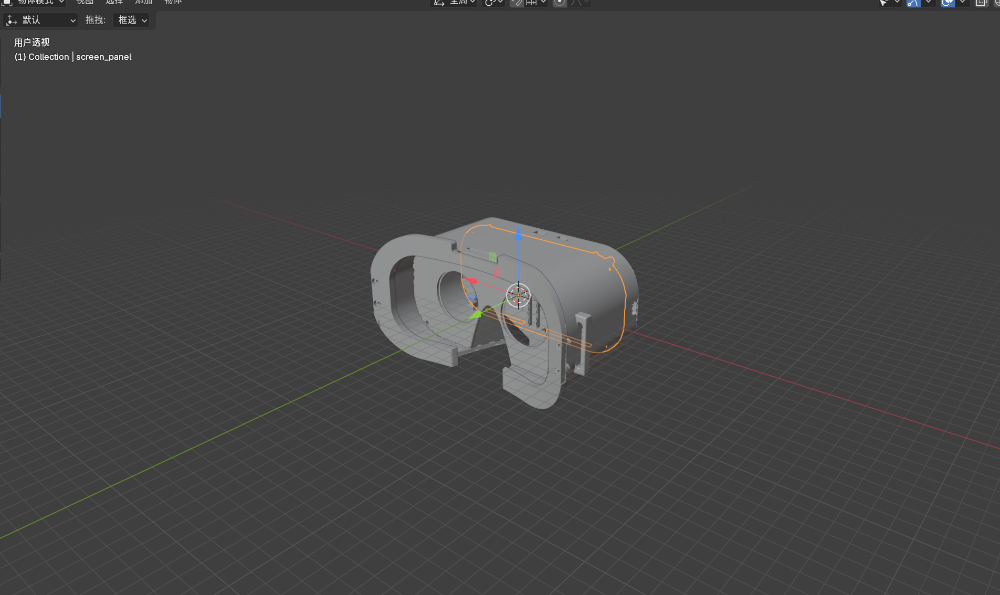
      
<strong>头显建模-组合</strong>

    </td>
    <td align="center" width="50%">
      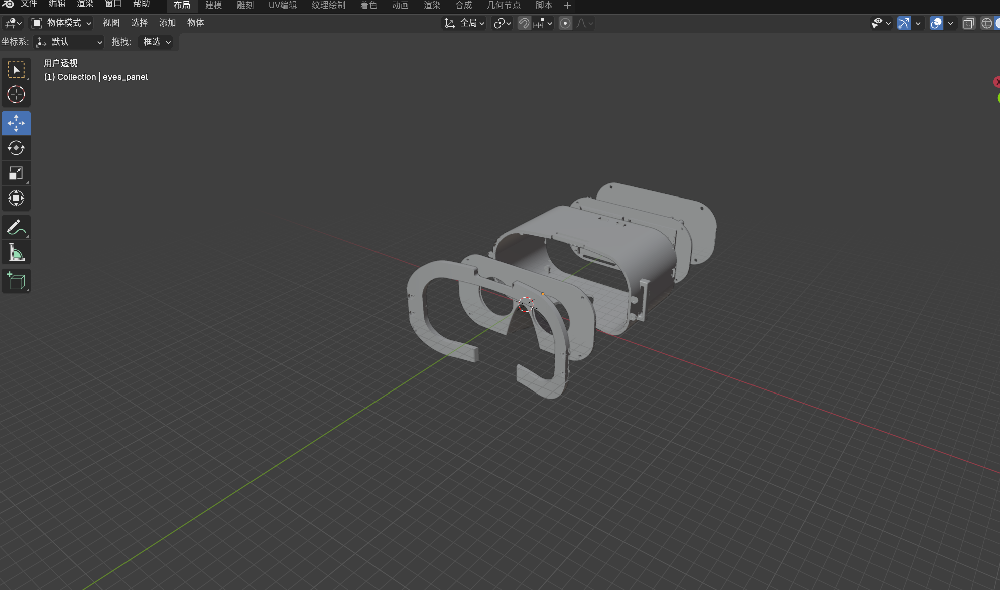
      
<strong>头显建模-拆解</strong>

    </td>
  </tr>
</table>

VR眼镜部分针对人脸面部结构进行了设计，使用了白色树脂材料，保证镜框弧度贴合大多数人脸面部，头带可拆卸弹性条，能适应不同头围并分散压力，减少对颧骨的压迫感。

